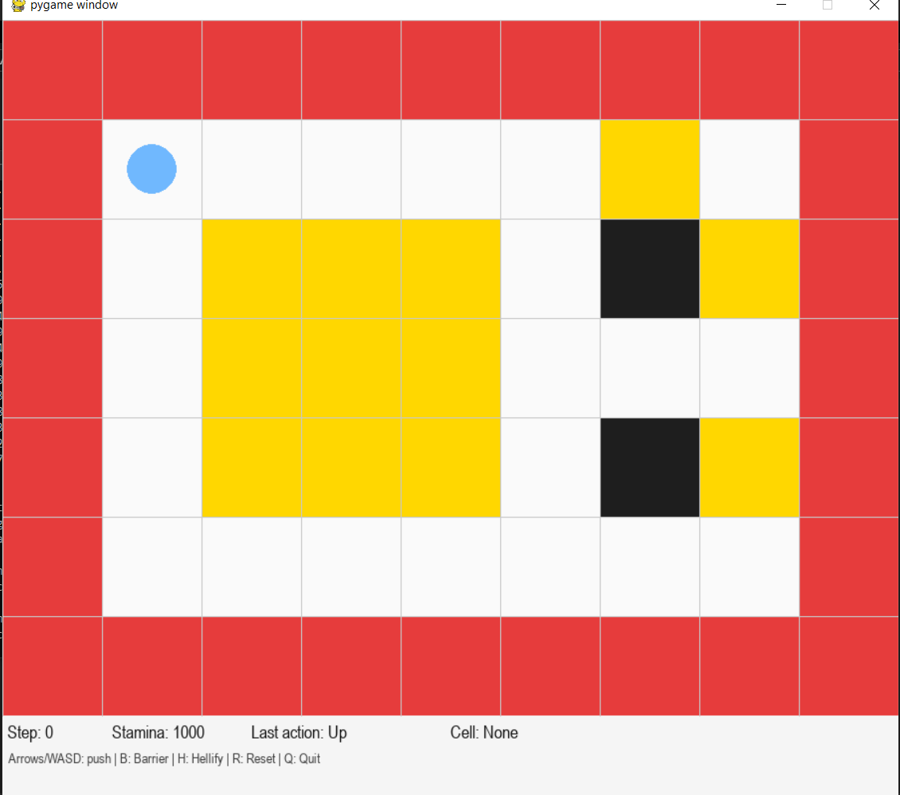

# ShoverWorld: A Grid-Based Puzzle Environment
## Overview
ShoverWorld is a 2D grid environment where a Shover navigates through a world containing boxes, barriers, and lava. The agent must push boxes to clear the board while managing stamina and using special abilities to transform perfect squares of boxes into obstacles. The project is divided into two phases:
  ### Phase 1:
  Implementation of a Gym-compatible environment with stamina mechanics, perfect-square detection, Pygame GUI, and file-based map loading.
  ### Phase 2: 
  Development of an AI agent using A* search algorithm to solve challenging puzzle configurations.

